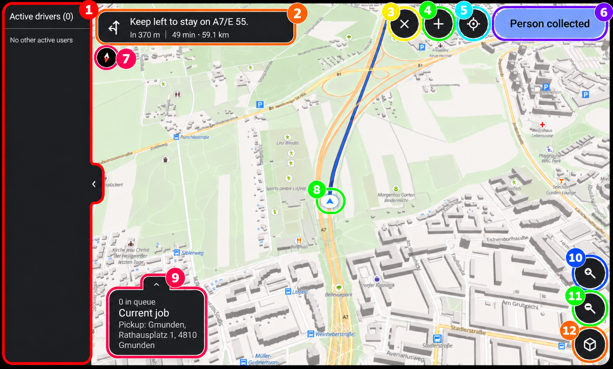

# Atlas Android Auto Manual

The Atlas Android Auto application provides navigation, job management and live fleet information directly on the vehicle display. The available functions depend on whether the user selected the driver or dispatcher role.

## Getting Started

Connect the phone to the vehicle and open Atlas through Android Auto.

Login and role selection must be completed in the Atlas application on the connected phone. Until this is done, Android Auto displays the “Continue on your phone” screen. The vehicle display continues automatically once a role has been selected.

If the user logs out, Android Auto returns to this screen.

### Vehicle Data Permissions

On the first connection, Atlas may request permission to access connected Bluetooth devices, fuel level and mileage.

Press “Allow vehicle data” while the vehicle is parked and confirm the permission request on the phone.

> [!NOTE]
> Android Auto may disable some interactions, while the vehicle is moving.

Atlas can continue without all permissions, but missing vehicle information cannot be transmitted and automatic odometer-based calculations may be unavailable.

If the connected vehicle has not been registered yet, an administrator may also receive a pairing dialog on the phone. Select the corresponding vehicle from the fleet list to associate it with the detected vehicle fingerprint.

## Main Map

The main screen consists of a live map showing the current vehicle position, the active route and other active Atlas users.

The bottom job card displays:

- The number of assigned jobs waiting in the queue.
- The current job.
- The pickup address before the passenger has been collected.
- The destination after the passenger has been collected.

The arrow above the job card can be used to collapse or expand it.

When a route is active, navigation instructions are displayed on the map. These include the next manoeuvre, distance to the manoeuvre, remaining travel time and remaining route distance. Atlas automatically recalculates the route after detecting that the vehicle has left the planned route or is travelling in the wrong direction.

### Map Controls

The available map controls allow you to:

- Pan the map.
- Zoom in or out.
- Change the map tilt.
- Recenter the map on the current vehicle position.
- Press the compass to return the map to a north-up view.

Panning the map stops automatic camera tracking. Press the recenter button to follow the vehicle again.

1 - Driver List

2 - Turn-by-Turn Navigation

3 - Job Cancel Button

4 - New Job Button

5 - Center on Current Location Button

6 - Job Lifecycle Button

7 - Center North Button

8 - Current Location Puck

9 - Job card

10 - Zoom In Button

11 - Zoom Out

12 - Map Tilt Button

## Driver Mode

Driver mode is used to process the jobs assigned to the current driver.

### Starting a Job

The job card shows how many assigned jobs are waiting. Press “Next job” to start the first job in the queue.

Atlas initially calculates a route from the current vehicle position to the pickup address.

A starting odometer value must be available before a job can be started. Atlas retrieves it automatically when supported by the vehicle. Otherwise, enter the odometer in the Atlas application on the phone.

> [!NOTE]
> Only one job can be active at a time. The current job must be completed or cancelled before the next job can be started.

### Collecting the Passenger

After reaching the pickup location, press “Person collected”.

Atlas then:

- Marks the vehicle as occupied.
- Records the current odometer when available.
- Changes the job card from the pickup address to the destination.
- Calculates a new route to the destination.

If the job has no destination, no route can be displayed after the passenger has been collected.

### Finishing a Job

After reaching the destination, press “Job finished”.

A confirmation screen is displayed. If complete odometer and pricing information is available, it shows:

- The total distance and price.
- The distance and price while travelling with the passenger.
- The configured price per kilometre.

Press “Yes” to complete the job or “No” to return to the map.

If no destination was entered for the job, the current vehicle position is saved as its destination when the job is completed.

### Cancelling a Job

Press the X icon while a job is active to cancel it.

## Job Notifications

A notification is displayed when a new job is assigned. It may include the pickup address, destination and note. The progress bar indicates how long the notification remains visible.

Press “Decline” to reject the assigned job. If no action is taken, the notification closes after ten seconds and the job remains assigned in the queue.

Dispatchers also receive notifications for newly created unassigned jobs. Press “Assign Now” to open the assignment screen. If the notification closes, the job remains unassigned and can still be managed through the Web-UI.

## Dispatcher Mode

Dispatcher mode adds fleet monitoring and job assignment functions to the main map.

### Active Drivers

The sidebar shows all other currently active drivers. Each entry displays the driver’s name and current status:

- Free
- On the way
- Occupied
- Away

Drivers are also displayed on the live map. Use the arrow beside the sidebar to hide or show the list.

### New / Assign Job

Press the plus icon to create a new job. The same screen opens when “Assign Now” is selected on an unassigned job notification.

The assignment screen contains the following fields:

- From:
  The pickup location. This field is required.

- To:
  The optional destination.

- Pickup time:
  Existing unassigned jobs display their configured pickup time. New jobs created through Android Auto use the current time, because there is no time picker.

- Note:
  Optional additional information for the driver.

Selecting an address field opens the address search. Atlas displays matching results and remembers recently selected addresses for faster reuse.

Once both a pickup location and destination have been selected, the calculated route is shown on the map. If only one location is available, Atlas centres the map on that location.

> [!WARNING]
> It is highly recommended to enter both a pickup location and a destination. Jobs without a destination cannot provide navigation after the passenger has been collected and may reduce the accuracy of route planning and driver recommendations.

### Driver Recommendations

Once a pickup location has been selected, Atlas calculates a ranked list of recommended drivers. Each entry displays the driver’s rank, name and estimated time until pickup.

Select a driver and press “Assign Job” to assign the job. The selected driver receives the assignment almost immediately.

When creating a new job, “Create unassigned” can be selected instead. The job is then saved without a driver and can be assigned later.

For an existing unassigned job:

- The pickup location is read-only.
- The destination and note may be changed.
- The original pickup time is retained.
- A driver must be selected before the job can be assigned.

## Ending the Shift

Shifts are ended through the Atlas application on the connected phone. The phone application collects the ending odometer, vehicle and cash revenue information required for the logbook.

After the shift has ended and the user has been logged out, Android Auto returns to the “Continue on your phone” screen.
